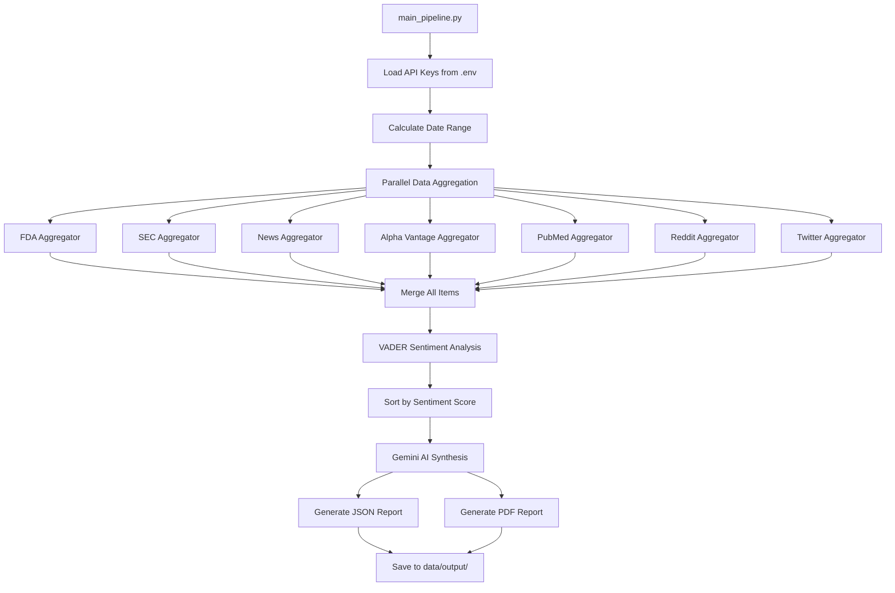

# Stock Sentiment Scraper

A generic sentiment analysis tool for pharmaceutical and life sciences stocks. Aggregates data from multiple sources, performs AI-powered sentiment analysis, and generates professional PDF reports.

## Overview

The Stock Sentiment Scraper analyzes public sentiment about any publicly traded pharmaceutical/biotech company by collecting data from 7+ sources, applying domain-specific sentiment analysis, and synthesizing findings into actionable insights.

**Key Features**:
- ✅ **Generic Design** - Works with any stock ticker (RVTY, TMO, A, etc.)
- ✅ **Multi-Source Aggregation** - Collects from 7 data sources in parallel
- ✅ **Domain-Specific Analysis** - VADER sentiment with pharmaceutical/financial rules
- ✅ **AI Synthesis** - Google Gemini generates executive summaries
- ✅ **Professional Reports** - PDF + JSON output with full raw data
- ✅ **Fast Parallel Execution** - ThreadPoolExecutor for concurrent API calls

## Data Sources

The scraper aggregates data from 7 sources:

| Source | Type | API | Data Collected |
|--------|------|-----|----------------|
| **FDA** | Regulatory | openFDA 510k | Device clearances, approvals |
| **SEC Edgar** | Financial | SEC.gov | 10-K, 10-Q, 8-K filings |
| **NewsAPI** | News | NewsAPI.org | News articles (100/query) |
| **Alpha Vantage** | Financial News | AlphaVantage.co | News with sentiment scores (50/query) |
| **PubMed** | Medical Literature | NCBI E-utilities | Journal citations (50/query) |
| **Reddit** | Social Media | ScrapeCreators | Subreddit discussions |
| **Twitter/X** | Social Media | ScrapeCreators | Tweets mentioning ticker |

### Data Collection Details

**FDA (openFDA)**:
- Endpoint: `https://api.fda.gov/device/510k.json`
- Search: Company name in applicant field
- Returns: Device clearances with dates, decision codes
- Sentiment: Approvals = positive signal

**SEC Edgar**:
- Endpoint: `https://www.sec.gov/cgi-bin/browse-edgar`
- Search: Ticker symbol
- Returns: Recent filings (10-K, 10-Q, 8-K) with dates, URLs
- Requires: User-Agent header per SEC rules

**NewsAPI**:
- Endpoint: `https://newsapi.org/v2/everything`
- Search: Company name OR ticker
- Returns: Articles with title, description, source, publish date, URL
- API Key: Required (free tier: 100 requests/day)

**Alpha Vantage**:
- Endpoint: `https://www.alphavantage.co/query` (NEWS_SENTIMENT function)
- Search: Stock ticker
- Returns: News with **pre-computed sentiment scores** (-1 to +1), relevance scores
- API Key: Required (free tier: 25 requests/day)
- **Unique**: Only source providing native sentiment analysis

**PubMed (NCBI E-utilities)**:
- Endpoints:
  - `https://eutils.ncbi.nlm.nih.gov/entrez/eutils/esearch.fcgi` (search)
  - `https://eutils.ncbi.nlm.nih.gov/entrez/eutils/esummary.fcgi` (details)
- Search: Company name in affiliation or all fields
- Returns: PMID, title, authors, journal, publication date
- API Key: Optional (increases rate limit from 3/sec to 10/sec)

**Reddit (ScrapeCreators)**:
- Endpoint: `https://api.scrapecreators.com/v1/reddit/search`
- Search: Company name OR ticker
- Returns: Posts with title, text, subreddit, score, comments, date
- API Key: Required

**Twitter (ScrapeCreators)**:
- Endpoint: `https://api.scrapecreators.com/v1/twitter/search`
- Search: $TICKER (cashtag)
- Returns: Tweets with text, author, likes, retweets, date
- API Key: Required

## What It Does With The Data

### 1. Data Aggregation (Parallel)
- Executes all 7 aggregators concurrently using `ThreadPoolExecutor`
- Each aggregator returns standardized dict format: `[{source, title, date, ...}]`
- Gracefully handles API errors (returns empty list, continues)

### 2. Sentiment Analysis (VADER)
Uses **VADER (Valence Aware Dictionary and sEntiment Reasoner)** with custom pharmaceutical/financial rules:

**Domain-Specific Positive Signals**:
- `fda approval`, `510k clearance`, `breakthrough designation`
- `earnings beat`, `revenue growth`, `upgrade`
- `clinical trial success`, `patent approval`

**Domain-Specific Negative Signals**:
- `warning letter`, `recall`, `black box warning`
- `downgrade`, `lawsuit`, `investigation`
- `earnings miss`, `layoffs`, `bankruptcy`

**Output** (per item):
```json
{
  "sentiment": {
    "label": "positive|negative|neutral",
    "score": -1.0 to 1.0,
    "confidence": 0.0 to 1.0
  }
}
```

### 3. AI Synthesis (Google Gemini)
- **Model**: `gemini-2.5-flash` (latest, deterministic with temperature=0)
- **Input**: Top positive/negative items, sentiment breakdown, date range
- **Output**: 2-paragraph executive summary (150-200 words)
- **Prompt Focus**: Data-driven, no speculation, financial language
- **Token Limit**: 4000 (accounts for extended thinking tokens)

### 4. Report Generation

**JSON Report** (`{TICKER}_sentiment_{timestamp}.json`):
```json
{
  "company": "Revvity",
  "ticker": "RVTY",
  "period": {"from": "2026-03-21", "to": "2026-03-28", "days": 7},
  "sentiment_breakdown": {"positive": 13, "negative": 6, "neutral": 6},
  "synthesis": {
    "executive_summary": "...",
    "key_findings": ["✓ ...", "✗ ..."],
    "overall_sentiment": "positive"
  },
  "top_positive": [...],  // Top 10 with title, date, source, score
  "top_negative": [...],  // Top 10 with title, date, source, score
  "raw_data": {
    "total_items": 25,
    "items": [...]  // ALL items with complete fields from all sources
  }
}
```

**PDF Report** (`{TICKER}_sentiment_{timestamp}.pdf`):
- Title page with company, ticker, date range
- Executive summary (AI-generated)
- Sentiment breakdown table with percentages
- Overall sentiment indicator (color-coded)
- Key findings table
- Top 5 positive events table (title, source, date, score)
- Top 5 negative events table (title, source, date, score)

## Installation

### Prerequisites
- **Python**: 3.12 or higher
- **pip**: Python package manager

### Install Dependencies

```bash
cd stock-sentiment-scraper
pip install -r requirements.txt
```

**Required Packages**:
- `requests` - HTTP API calls
- `python-dotenv` - Environment variable management
- `vaderSentiment` - Sentiment analysis
- `google-genai` - Google Gemini AI SDK (NEW SDK, not google-generativeai)
- `reportlab` - PDF generation
- `pandas` - Data manipulation (optional)
- `matplotlib` - Visualization (optional, future use)

### API Keys Setup

Create `.env` file in project root (`nephron-data-agents/.env`):

```bash
# Google Gemini API (Required for AI synthesis)
# Get key: https://aistudio.google.com/apikey
GEMINI_API_KEY=your_gemini_api_key_here

# NewsAPI (Required for news articles)
# Get key: https://newsapi.org/register
NEWS_API_KEY=your_newsapi_key_here

# Alpha Vantage (Required for financial news sentiment)
# Get key: https://www.alphavantage.co/support/#api-key
ALPHA_VANTAGE_API_KEY=your_alpha_vantage_key_here

# ScrapeCreators (Required for social media)
# Get key: https://scrapecreators.com/
SCRAPECREATORS_API_KEY=your_scrapecreators_key_here

# NCBI E-utilities (Optional, increases PubMed rate limit)
# Get key: https://www.ncbi.nlm.nih.gov/account/settings/
NCBI_API_KEY=your_ncbi_api_key_here
```

**Note**: FDA and SEC APIs are public and don't require keys.

## Usage

### Command Line

```bash
cd stock-sentiment-scraper
python src/main/python/main_pipeline.py <TICKER> <COMPANY_NAME> [DAYS]
```

**Parameters**:
- `TICKER` - Stock ticker symbol (e.g., "RVTY", "TMO", "A")
- `COMPANY_NAME` - Full company name in quotes (e.g., "Revvity")
- `DAYS` - (Optional) Number of days to analyze (default: 30)

### Examples

**Analyze Revvity over last 7 days**:
```bash
python src/main/python/main_pipeline.py RVTY "Revvity" 7
```

**Analyze Thermo Fisher over last 30 days** (default):
```bash
python src/main/python/main_pipeline.py TMO "Thermo Fisher Scientific"
```

**Analyze Agilent over last 14 days**:
```bash
python src/main/python/main_pipeline.py A "Agilent Technologies" 14
```

### Output Location

All reports are saved to:
```
stock-sentiment-scraper/data/output/
├── RVTY_sentiment_2026-03-28_045920.json  (30 KB - with raw data)
└── RVTY_sentiment_2026-03-28_045920.pdf   (5.8 KB - professional report)
```

### Console Output

The scraper prints real-time progress:

```
============================================================
Stock Sentiment Analysis - Revvity (RVTY)
============================================================

Period: 2026-03-21 to 2026-03-28 (7 days)

Phase 1: Aggregating data from multiple sources...
------------------------------------------------------------
[FDA] Searching for Revvity...
[News] Searching for Revvity OR RVTY...
[SEC] Searching filings for RVTY...
[PubMed] Searching for Revvity...
[Reddit] Searching for Revvity...
[Twitter] Searching for RVTY...
[Alpha Vantage] Searching news sentiment for RVTY...

[Alpha Vantage] Found 22 articles
[News] Found 2 articles
[PubMed] Retrieved 1 publication details
[SEC] Found 0 filings

Total items collected: 25

Phase 2: Analyzing sentiment...
------------------------------------------------------------
[Sentiment] Analyzing 25 items...
[Sentiment] Positive: 13, Negative: 6, Neutral: 6

Phase 3: Generating executive summary...
------------------------------------------------------------
[Gemini] Generating executive summary...
[Gemini] Generated 1480 character summary

JSON report saved to: .../RVTY_sentiment_2026-03-28_045920.json
[PDF] Report saved to .../RVTY_sentiment_2026-03-28_045920.pdf
PDF report saved to: .../RVTY_sentiment_2026-03-28_045920.pdf

============================================================
EXECUTIVE SUMMARY
============================================================
Revvity (RVTY) demonstrated a predominantly positive sentiment...

============================================================
SENTIMENT BREAKDOWN
============================================================
Positive: 13
Negative: 6
Neutral:  6
Total:    25

============================================================
TOP POSITIVE EVENTS
============================================================
1. [news] Nephron Research gets more bullish on Revvity, upgrades shares
   Score: 0.991 | Date: 2026-03-26
...
```

## Architecture

### Project Structure

```
stock-sentiment-scraper/
├── README.md                          # This file
├── requirements.txt                   # Python dependencies
├── data/
│   ├── source/                        # (Future) Input data files
│   └── output/                        # Generated reports (JSON + PDF)
└── src/main/python/
    ├── main_pipeline.py               # Main orchestrator
    ├── utils/
    │   ├── __init__.py
    │   └── date_utils.py              # Date range calculation
    ├── aggregators/
    │   ├── __init__.py
    │   ├── fda_aggregator.py          # FDA 510k data
    │   ├── sec_aggregator.py          # SEC filings
    │   ├── news_aggregator.py         # NewsAPI articles
    │   ├── alpha_vantage_aggregator.py # Alpha Vantage news sentiment
    │   ├── pubmed_aggregator.py       # PubMed citations
    │   └── social_aggregator.py       # Reddit + Twitter (ScrapeCreators)
    ├── sentiment/
    │   ├── __init__.py
    │   └── vader_analyzer.py          # VADER sentiment analysis
    ├── synthesis/
    │   ├── __init__.py
    │   └── gemini_synthesizer.py     # Google Gemini AI summary
    └── output/
        ├── __init__.py
        └── pdf_generator.py           # ReportLab PDF generation
```

### Execution Flow



### Key Design Decisions

**1. Parallel Aggregation**:
- Uses `ThreadPoolExecutor` with 7 workers (one per source)
- Total runtime ~30-60 seconds (vs. 3-4 minutes sequential)
- Each aggregator runs independently, failures don't block others

**2. Standardized Output Format**:
All aggregators return: `List[Dict]` with common fields:
```python
{
    'source': 'fda|sec|news|alpha_vantage|pubmed|reddit|twitter',
    'title': 'Event/article title',
    'date': 'YYYY-MM-DD',
    # ... source-specific fields
}
```

**3. Error Handling**:
- API failures return empty list `[]`, not exceptions
- Stderr logging for debugging (doesn't pollute stdout)
- Graceful degradation: missing API keys skip that source

**4. Sentiment Strategy**:
- VADER for text analysis (domain-specific rules)
- Alpha Vantage provides native sentiment (used as-is)
- Composite score from both methods

**5. AI Synthesis**:
- Temperature=0 for deterministic output
- High token limit (4000) for gemini-2.5-flash thinking tokens
- Fallback to basic summary if API fails

## Performance

**Test Results** (7-day analysis):

| Ticker | Items Collected | Sources Hit | Runtime | JSON Size | PDF Size |
|--------|----------------|-------------|---------|-----------|----------|
| RVTY   | 25             | 7           | ~45 sec | 30 KB     | 5.8 KB   |
| TMO    | 116            | 7           | ~55 sec | 120 KB    | 6.2 KB   |

**Bottlenecks**:
- PubMed rate limiting (3 req/sec without API key)
- Alpha Vantage free tier (25 requests/day)
- Gemini thinking tokens (can consume 300-400 tokens)

## Limitations

**API Rate Limits**:
- NewsAPI Free: 100 requests/day
- Alpha Vantage Free: 25 requests/day
- ScrapeCreators: Depends on plan
- PubMed: 3 req/sec (10 with API key)

**Data Quality**:
- News articles may not be stock-specific (false positives)
- Social media APIs (Reddit/Twitter) currently returning 404s
- FDA data limited to device companies (not all pharma)
- SEC filings are factual (neutral sentiment)

**Sentiment Analysis**:
- VADER is rule-based, not deep learning
- Medical/scientific text often misclassified as negative (disease mentions)
- Context-independent (sarcasm, irony not detected)

## Future Enhancements

**Planned**:
- [ ] Matplotlib sentiment trend charts (30-day timeline)
- [ ] Maven integration (Java orchestrator for CI/CD)
- [ ] GitHub Actions workflow (scheduled runs)
- [ ] Historical comparison (month-over-month trends)
- [ ] Source weighting (FDA=40%, News=25%, Medical=20%, Social=10%, Other=5%)

**Under Consideration**:
- [ ] Email/Slack notifications for alerts
- [ ] Real-time streaming mode
- [ ] Comparative analysis (multiple tickers side-by-side)
- [ ] Customizable sentiment rules per company

## Troubleshooting

**"No data collected"**:
- Check API keys in `.env` file
- Verify company name spelling (use exact name from company website)
- Try increasing `DAYS` parameter (data may be sparse)

**"Rate limit exceeded"**:
- Wait 24 hours (free tier resets daily)
- Upgrade to paid API plans
- Reduce `DAYS` parameter to limit API calls

**"Gemini response truncated"**:
- Already fixed (max_output_tokens=4000)
- If still occurs, check Gemini API quota

**"PDF generation failed"**:
- Install reportlab: `pip install reportlab`
- Check write permissions on `data/output/` directory

**"Import errors"**:
- Use `google-genai` (NOT `google-generativeai`)
- Run `pip install -r requirements.txt` to sync dependencies

## Contributing

This is part of the `nephron-data-agents` multi-module Maven project. When contributing:

1. Follow existing code structure (aggregators, sentiment, synthesis, output)
2. Add new data sources as separate aggregator modules
3. Maintain standardized output format for interoperability
4. Test with multiple tickers (RVTY, TMO, A) before committing
5. Update this README with new features/sources

## License

Internal tool for Nephron Research analysis. Not licensed for external use.

## Support

For issues or questions:
1. Check this README first
2. Review error messages in console output
3. Verify API keys are correct in `.env`
4. Check API service status (NewsAPI, Alpha Vantage, etc.)

---

**Last Updated**: 2026-03-28
**Version**: 1.0.0
**Python Version**: 3.12+
**Status**: Production-ready POC
